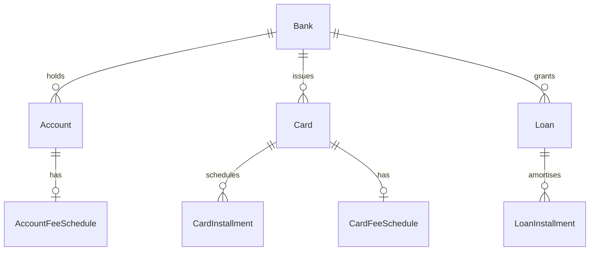

# ms-banks — domain

Aggregates, value objects, invariants and schema. Endpoints: `API.md`. Messaging: `EVENTS.md`.
Shared VOs (`Money`, `Cbu`, `BankNumber`, `UserId`): parent `.ai/references/APP_STRUCTURE.md`.

## Aggregates

| Aggregate | Root entity | Owned entities | Repository | Key invariant |
|---|---|---|---|---|
| Bank | `Bank` | — | `BankRepository` | Read-only global catalog seeded at startup; no per-user mutation |
| Account | `Account` (single class, `AccountType` field — not a subtype hierarchy) | — | `AccountRepository` | `CHECKING` or `SAVINGS` only; balance is a `Money`, adjusted only via debit/credit |
| Card | `Card` (abstract: `CreditCard`, `DebitCard`) | `CardInstallment` | `CardRepository` | `CardBehavior.INSTANT_PAYMENT` → `DebitCard`, else → `CreditCard`; only `CreditCard` carries a credit limit |
| Loan | `Loan` | `LoanInstallment` | `LoanRepository` | `AmortizationType.FRENCH` only; `originate()` builds the full schedule via `LoanAmortization`; lookups are scoped by `bankNumber` **and** `userId` (2026-06-12 fix — the unscoped `findByBankNumber` leaked cross-user loans) |
| BalanceSnapshot | `BalanceSnapshot` | — | `BalanceSnapshotRepository` | One row per user per day; written only by `BalanceSnapshotScheduler`, never user-writable |
| AccountFeeSchedule | `AccountFeeSchedule` | — | `AccountFeeScheduleRepository` | One per `Cbu`; `ivaTreatment` required; fees are display metadata and never post transactions |
| CardFeeSchedule | `CardFeeSchedule` | — | `CardFeeScheduleRepository` | One per `CardNumber`; `internationalSurchargePct` strictly in `(0, 100]` when present; fees never post transactions |

## Value objects

Service-local only — `Money`, `Cbu`, `BankNumber`, `UserId` are documented once at the parent.

| VO | What it wraps | Validation it enforces |
|---|---|---|
| `AccountNumber` | 13-digit account number — CBU positions 9–21 | `^\d{13}$` |
| `SucursalCode` | 4-digit branch code — CBU positions 4–7 | `^\d{4}$` |
| `CardNumber` | 16-digit PAN as `IssuerBin`(6) + `IssuerCardAccount`(9) + Luhn check digit | `from()` accepts a 15-digit BIN+account (computes the check digit) or a full 16-digit PAN (validates the Luhn digit); `toString()` masks all but the last 4 |
| `CardBilling` | `closingDay`, `dueDay` | Both in `[1, 31]` |

## Enumerations

| Enum | Values | What decides the value |
|---|---|---|
| `AccountType` | `CHECKING`, `SAVINGS` | Set explicitly at account open; `INVESTMENT` was removed (V18) |
| `CardBrand` | `VISA`, `MASTERCARD`, `AMEX` | Set at card issue |
| `CardType` | `STANDARD`, `SILVER`, `GOLD`, `BLACK`, `PLATINUM` | Set at card issue |
| `CardBehavior` | `CREDIT`, `INSTANT_PAYMENT` | Decides the `Card.create()` subtype |
| `AmortizationType` | `FRENCH` | Only method implemented; `LoanAmortization` computes the schedule |
| `IvaTreatment` (commons-core) | `SEPARATE`, `INCLUDED`, `EXEMPT` | Set on fee-schedule upsert |

## Domain services

| Service | The single decision it owns |
|---|---|
| `ComputeBalanceSnapshot` | Consolidates cash, current-statement unpaid card installments, and active loan principal by currency into one `BalanceSnapshot` |
| `CardBillingCycle` | Computes the current billing period (closing/due dates, `statementOpen`) with month-end day clamping and due-day month rolling |
| `CreditLimitUsage` | Computes a card's used amount and credit-limit utilization percentage |
| `DebitCreditTax` | Tax rate by `AccountType` (`CHECKING` → 0.006, `SAVINGS` → 0.000) |
| `CardInstallmentEventFactory` | Builds `CardInstallmentPaidEvent` from a just-paid installment, so the application layer never constructs `domain.event` types directly |

## ERD

`BalanceSnapshot` has no foreign-key relation (keyed only by `userId`) and is omitted above.

## Schema `banks`

| Migration | What it adds |
|---|---|
| V1 | `banks` and `accounts` tables |
| V2 | `cards` and `card_installments` tables |
| V3 | `loans` and `loan_installments` tables |
| V4 | `bank_id` on cards and loans (move to bank-level ownership) |
| V5 | Wipes card/loan data (structural reset after V4) |
| V6 | `processed_events` table (superseded by V16's `inbound_events`) |
| V7 | `cbu` and `alias` columns on `accounts` |
| V8 | `card_number` column on `cards` |
| V9 | Makes `banks` a global read-only catalog (dedupes per-user rows) |
| V10 | Drops `logo_url` from the bank catalog |
| V11 | Drops orphaned `last_4_digits` from `cards` |
| V12 | Normalises legacy `card_behavior` values (`INSTALLMENTS` → `CREDIT`) |
| V13 | `bank_number` column on `banks` |
| V14 | `bank_number` `CHAR(3)` → `VARCHAR(3)` (Hibernate validation match) |
| V15 | `outbox_event` table |
| V16 | `inbound_events` table (idempotency; current `ProcessedEventGateway` target) |
| V17 | Scopes account-name uniqueness to `(user_id, bank_id, name)` |
| V18 | Deletes remaining `INVESTMENT`-type accounts |
| V19 | Drops `NOT NULL` on `accounts.alias` |
| V20 | `balance_snapshots` table (JSONB maps per currency) |
| V21 | `credit_limit` column on `cards` |
| V22 | `account_fee_schedules` table |
| V23 | `card_fee_schedules` table |
